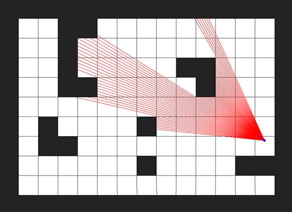
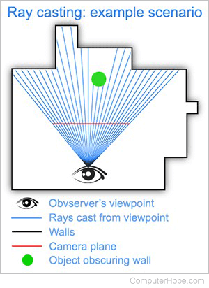
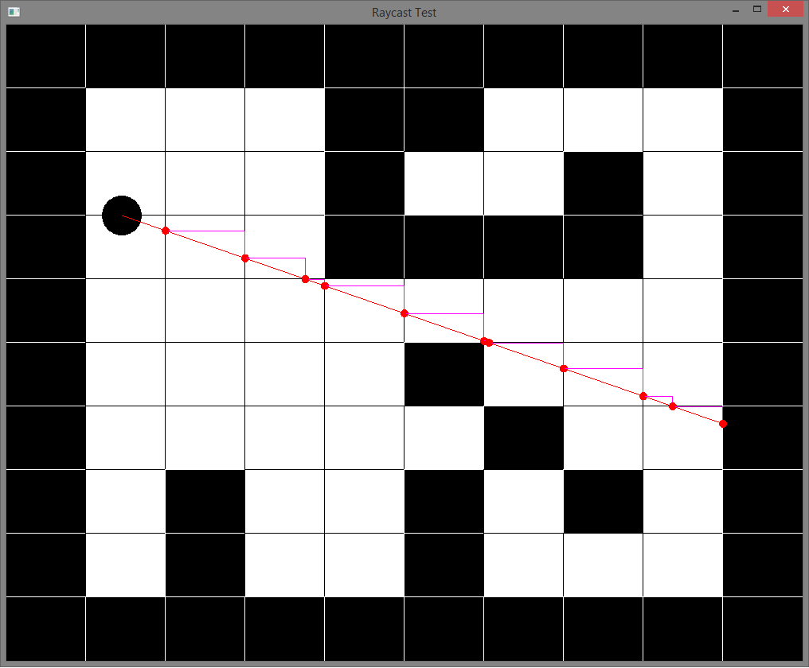
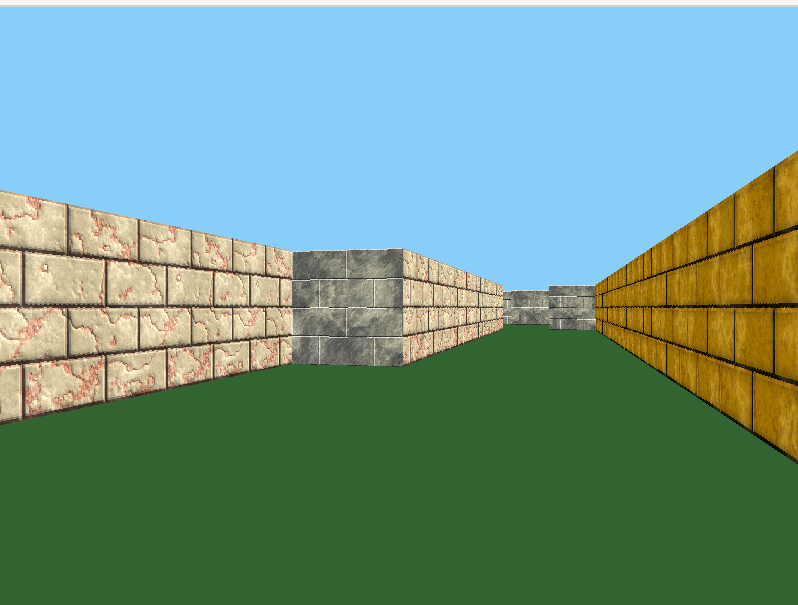

<p align="center">
  
</p>

# 🎮 cub3D — Raycasting Maze Game (School 42 Project)

**Languages:** [🇪🇸 Español](README.es.md) | [🇷🇺 Русский](README.ru.md)

## Project Description
**Cub3D** is a graphical project from School 42, aimed at creating a "3D" game in the style of the legendary **Wolfenstein 3D** (1992).  


### Technologies:

- **Language:** C 
- **Graphics Library:** [MLX42](https://github.com/codam-coding-college/MLX42) 
- **Compiler:** gcc
- **Code Standard:** Norminette (School 42) 
- **Platform:** Linux

### Project Goals:

-  Read and validate `.cub` configuration and map file
-  Implement **ray casting** for pseudo-3D rendering
-  Implement player controls (WASD + rotation with arrows/mouse)
-  Apply textures to walls based on their orientation
-  Set different colors for floor and ceiling

---

## 📋 Table of Contents

- [Project Structure](#project-structure)
- [What is Ray Casting](#what-is-ray-casting)
- [Phase 1: Parsing and Validation](#phase1)
- [Phase 2: Ray Casting and DDA](#phase2)
- [Phase 3: Rendering](#phase3)
- [Installation and Usage](#installation-and-usage)

## Project Structure

The project is conditionally divided into **3 main phases**:

### 1️⃣ Reading and Validating `.cub` File
- Parsing configuration (textures, colors)
- Parsing map
- Validation: symbol correctness, player presence, map closure

### 2️⃣ Implementing Ray Casting and DDA Algorithms
- Ray initialization for each screen column
- DDA (Digital Differential Analyzer) for grid traversal
- Distance calculation to walls without "fish-eye" distortion

### 3️⃣ Image Rendering
- Drawing floor and ceiling
- Applying textures to walls
- Matching screen column to texture column
- Player control and frame updates

---

## What is Ray Casting?

**Ray Casting** is a pseudo-3D graphics rendering technique (2.5D) that creates the illusion of three-dimensional space based on a two-dimensional map.

### Main Idea:
**For each vertical screen column:**
1. Cast a ray from the player's position
2. The ray travels through the map until it hits a wall
3. Measure the distance to the wall
4. Draw a vertical strip: the closer the wall, the taller the strip

**Result for 640x480 resolution:** 640 vertical strips of different heights that create the illusion of a 3D maze.

This technique allowed games to run on early 1990s processors — no real 3D graphics, just clever mathematics!

---
<a name="phase1"></a>
# Phase 1️⃣: Parsing and Validation

 - [.cub File Structure](#--cub-file-structure)
 - [Structure Initialization and File Reading](#structure-initialization-and-file-reading)
 - [Configuration Parsing](#configuration-parsing)
 - [Map Parsing](#map-parsing)
 - [Map Validation](#map-validation)
 - [BFS for Closure Verification](#bfs-for-closure-verification)

## 📦 .cub File Structure

The .cub file contains all necessary information to launch the game:

- Paths to textures for four walls (`NO`, `SO`, `WE`, `EA`)  
- Floor and ceiling colors (`F`, `C`) in `R,G,B` format  
- Maze map made of symbols `0`, `1`, `N`, `S`, `E`, `W`  

Example map file:  
```text
NO ./textures/north_wall.png
SO ./textures/south_wall.png
WE ./textures/west_wall.png
EA ./textures/east_wall.png

F 220,100,0
C 225,30,0

        1111111111111111111111111
        1000000000110000000000001
        1011000001110000000000001
        1001000000000000000000001
111111111011000001110000000000001
100000000011000001110111111111111
11110111111111011100000010001
11110111111111011101010010001
11000000110101011100000010001
10000000000000001100000010001
10000000000000001101010010001
11000001110101011111011110N0111
11110111 1110101 101111010001
11111111 1111111 111111111111
```
---

## Structure Initialization and File Reading

- Game state initialization *init_game()*, MLX and image *init_engine()*  
- In *init_game_data()* structures are zeroed, default values are set  
- *.cub* file is read line by line using **get_next_line** (from libft)  
- All lines are stored in a dynamic array

Checks:  
✅ Number of arguments on call  
✅ File extension — *.cub*  
✅ File exists and is accessible for reading  
✅ File is not empty  

---

## Configuration Parsing

Find the map start *map_start*. Everything above is config, everything below is map. Parse config:  
- Parse lines with identifiers `NO`, `SO`, `WE`, `EA`, `F`, `C`  
- Extract texture paths and RGB values  
- For example, line: `NO ./textures/north_wall.png` is parsed into:  
	- identifier: `NO`  
	- path: `./textures/north_wall.png`  

Checks:  
✅ Identifier is correct (NO/SO/WE/EA)  
✅ Path is specified and not empty  
✅ Texture file exists  
✅ Each texture is specified exactly once  

Color parsing:
Line: `F 220,100,0`:  
identifier: `F` (floor)  
RGB: R=220, G=100, B=0  

Checks:  
✅ Format: R,G,B (no spaces around commas)  
✅ Each value is a number from 0 to 255  
✅ Exactly 3 components (R, G, B)  
✅ F and C are specified exactly once  

**RGB to hex conversion:**  
R=220, G=100, B=0  
hex = (R << 16) | (G << 8) | B  
hex = 0xDC6400  
MLX42 accepts color in RGBA (A - transparency) format, not RGB like MiniLibX, so before use we shift the color by 8 bits more (<< 8).

## Map Parsing

- Read all map lines into a 2D array *char map->grid*  
- Determine map width and height  
- Valid symbols:  

`0` — empty space (passable)  
`1` — wall (impassable)  
`N`, `S`, `E`, `W` — starting position and player's view direction  
`(space)` — void beyond the map  

## Map Validation

### Map Closure Check

**What is a "closed" map?**  
A closed map is one where all cells accessible to the player (symbols `0`, `N/S/E/W`) are surrounded by walls (`1`). The player should not be able to "exit" beyond the game area. If there's a hole in the map (a space at the boundary of the accessible area), it will lead to undefined behavior during rendering.

**Key criterion for non-closure:**  
***❌ Map is not closed if any accessible cell (`0`) borders a space (` `).***

In other words:  
✅ Cell `0` can neighbor `0` (another accessible cell)  
✅ Cell `0` can neighbor `1` (wall — game area boundary)  
❌ Cell `0` CANNOT neighbor ` ` (space — void beyond the map)  

**About spaces in the map:**  
Space is a legal symbol in the `.cub` file. It's used for:
- Map alignment (left indentation)
- Marking "nothing" beyond the game area

Example of valid space usage:
```
  111111111111    ← Spaces on left for indentation (OK)
  100000000001
111N0111100111
100001 10001      ← Space inside surrounded by walls (OK)
111111 11111
```

But if a space borders an accessible cell — it's a hole:
```
11111111
1000000           ← Space on right borders `0` — HOLE!
100N0001
10000001
11111111
```

---

### BFS for Closure Verification

To verify map closure, an iterative breadth-first search algorithm is used — **Breadth-First Search (BFS)**.

<p align="left">
  
</p>

**Why BFS instead of recursive Flood Fill (DFS)?**

| Criterion | BFS (iterative) | DFS (recursive) |
|----------|-----------------|-----------------|
| Safety | ✅ No stack overflow risk | ❌ Can crash on large maps |
| Complexity | O(width × height) | O(width × height) |
| Memory | Queue sized width × height | Call stack (unpredictable) |
| Readability | ✅ Iterative code easy to debug | Harder to trace recursion |
| Completeness | ✅ Guaranteed to traverse all cells | ✅ Traverses all cells |

---

### Data Structures for BFS

**Point on map:**
```c
typedef struct s_point
{
    int x;  // X coordinate
    int y;  // Y coordinate
} t_point;
```

**Circular queue:**
```c
typedef struct s_queue
{
    t_point *data;         // Point array
    int     first;         // First element index
    int     last;          // Last element index
    int     current_size;  // Current number of elements
    int     capacity;      // Maximum capacity
} t_queue;
```

**Why circular queue?**
- **Efficient memory usage:** after `dequeue`, space is freed and reused
- **O(1) for operations:** `enqueue` and `dequeue` execute in constant time
- **Avoid shifts:** no need to constantly shift array elements

**BFS data:**
```c
typedef struct s_bfs_data
{
    int     **visited;  // Matrix of visited cells (0 or 1)
    t_queue *queue;     // Queue for traversal
} t_bfs_data;
```

---

### How the Algorithm Works

**Initialization (`init_bfs`):**
1. Create `visited` matrix sized `[height][width]` (all values = `0`)
2. Create circular queue sized `height × width`
3. Find player's starting position (`N`, `S`, `E`, `W`)
4. Add starting position to queue
5. Mark starting cell as visited (`visited[y][x] = 1`)

**Breadth-first traversal (`process_bfs`):**

While queue is not empty:
1. Extract cell from queue (`dequeue`)
2. Check **4 neighboring cells** (up, down, left, right)
3. For each neighbor call `check_cell`:
   - If it's `0` (accessible cell):
     - Mark as visited
     - Add to queue
   - If it's `1` (wall):
     - Ignore (it's the game area boundary)
   - If it's ` ` (space):
     - **ERROR!** Accessible cell borders void
     - Map is not closed → return `0`

**Result:**
- ✅ All accessible cells checked without encountering spaces → map is closed
- ❌ At least one accessible cell borders a space → map is not closed

---

### Key Functions

| Function | Purpose |
|---------|---------|
| `init_bfs` | BFS initialization: creates `visited` matrix, queue, adds starting position |
| `process_bfs` | Main traversal loop: extracts cell, checks neighbors, returns result |
| `check_cell` | Checks specific cell: `0` → add to queue, `1` → ignore, ` ` → error |
| `can_visit` | Checks if cell can be visited: within map bounds and not visited before |
| `enqueue` | Adds cell to queue (accounting for circular structure) |
| `dequeue` | Extracts cell from queue |

---

### Validation Examples

**✅ Valid map:**
```
        1111111111111111111111111
        1000000000110000000000001
        1011000001110000000000001
        1001000000000000000000001
111111111011000001110000000000001
100000000011000001110111111111111
11110111111111011100000010001
11110111111111011101010010001
11000000110101011100000010001
10000000000000001100000010001
10000000000000001101010010001
11000001110101011111011110N0111
11110111 1110101 101111010001
11111111 1111111 111111111111
```
- All accessible cells (`0` and `N`) are surrounded by walls (`1`)
- Spaces inside map are surrounded by walls — don't border `0`

**❌ Invalid map (hole on right):**
```
11111111
10000000          ← Space on right borders `0`
100N0001
10000001
11111111
```
- BFS will reach the right edge and detect space next to `0`

---

### Key Files (validation)

| File | Purpose |
|------|---------|
| `validation.c` | Map symbol validation and player presence check |
| `bfs.c` | BFS implementation for map closure verification |
| `queue.c` | Circular queue implementation for BFS |
| `map_utils.c` | Helper functions for working with the map |

<a name="phase2"></a>
# Phase 2️⃣: Ray Casting and DDA

## Phase 2 Contents
- [Player and Camera Initialization](#player-and-camera-initialization)
  - [Player Position](#player-position)
  - [View Direction Vector](#view-direction-vector-direction-vector)
  - [Camera Plane](#camera-plane-camera-plane)
- [Screen Column Loop](#screen-column-loop)
  - [Ray Direction Calculation](#ray-direction-calculation)
- [DDA Algorithm](#dda-algorithm)
  - [Main Idea](#main-idea)
  - [DDA Initialization](#dda-initialization)
  - [DDA Loop](#dda-loop)
- [Wall Distance Calculation](#wall-distance-calculation)
  - [Problem: Fish-Eye Effect](#problem-fish-eye-effect)
  - [Solution: Perpendicular Distance](#solution-perpendicular-distance)
- [Collision Side Determination](#collision-side-determination)
- [Ray Casting Data Structures](#ray-casting-data-structures)
- [Key Files (phase 2)](#key-files-phase-2)

---

This phase handles the raycasting mathematics — the process of calculating distances to walls and determining what should be visible on screen.

---
<p align="left">
  
</p>
---

## Player and Camera Initialization

After successful map parsing, the player's position must be initialized and the "camera" configured. This happens in the `init_player()` function.

### Player Position

The player is located in the cell where symbol `N`, `S`, `E`, or `W` was found:
- `player.pos_x` — X coordinate in map grid (e.g., 5.5 — cell center)
- `player.pos_y` — Y coordinate in map grid

Player position is stored in the `t_player` structure:
```c
typedef struct s_player
{
    double  pos_x;      // Position X
    double  pos_y;      // Position Y
    double  dir_x;      // View direction X
    double  dir_y;      // View direction Y
    double  plane_x;    // Camera plane X
    double  plane_y;    // Camera plane Y
} t_player;
```

### View Direction Vector (direction vector)

---
<p align="left">
  
</p>
---

Determines where the player is looking. This is a unit vector:
- `dir_x` and `dir_y` form the direction vector
- Depends on the initial symbol on the map (`map.start_dir`):
  - `N` (North): `dir_x = 0`, `dir_y = -1` (looking up)
  - `S` (South): `dir_x = 0`, `dir_y = 1` (looking down)
  - `E` (East): `dir_x = 1`, `dir_y = 0` (looking right)
  - `W` (West): `dir_x = -1`, `dir_y = 0` (looking left)

### Camera Plane (camera plane)

The camera plane is a perpendicular vector to the view direction. It defines the Field of View (FOV):
- `plane_x` and `plane_y` — camera plane vector coordinates
- The length of this vector determines the viewing angle
- Typical length value: `0.66` (approximately 66° FOV)

**Example for player looking north (N):**
```c
player.dir_x = 0.0;
player.dir_y = -1.0;
player.plane_x = 0.66;   // Perpendicular to direction
player.plane_y = 0.0;
```

**Why is the plane perpendicular?**  
The camera plane is the "screen" in the game world. Rays pass through this plane, creating a cone of view. The longer the plane vector, the wider the FOV.

---

## Screen Column Loop

Raycasting is performed **for each vertical screen column**. If screen resolution is `800×600` (WIDTH × HEIGHT), then 800 rays need to be cast.

Main loop in `render_frame()` function:
```c
void render_frame(t_game *game)
{
    t_ray ray;
    int x;

    x = 0;
    while (x < WIDTH)
    {
        init_ray(game, x, &ray);     // Ray initialization
        dda(game, &ray);              // DDA algorithm
        calculate_wall_distance(game, &ray);  // Distance calculation
        draw_column(game, x, &ray);   // Column rendering
        x++;
    }
}
```

### Ray Direction Calculation

For each column `x` (from 0 to WIDTH - 1) in `init_ray()` function:

**1. Normalized camera coordinate:**
```c
double camera_x = 2 * x / (double)WIDTH - 1;
```
- Value from `-1` (left screen edge) to `+1` (right edge)
- When `x = 0`: `camera_x = -1`
- When `x = WIDTH/2`: `camera_x = 0` (center)
- When `x = WIDTH-1`: `camera_x ≈ +1`

**2. Ray direction:**
```c
ray->dir_x = game->player.dir_x + game->player.plane_x * camera_x;
ray->dir_y = game->player.dir_y + game->player.plane_y * camera_x;
```
- Ray passes through camera plane
- Central ray (`camera_x = 0`) matches view direction
- Side rays deviate left/right

**Why does this work?**
- Central ray: `ray_dir = dir + plane * 0 = dir` (pure view direction)
- Left edge: `ray_dir = dir + plane * (-1)` (deviation left)
- Right edge: `ray_dir = dir + plane * (+1)` (deviation right)

**3. Current map cell:**
```c
ray->map_x = (int)game->player.pos_x;
ray->map_y = (int)game->player.pos_y;
```

---

## DDA Algorithm

---
<p align="left">
  
</p>
---

**DDA (Digital Differential Analyzer)** — an algorithm that allows the ray to "step" through the map grid until collision with a wall.

### Main Idea

The ray moves through the map, crossing cell boundaries. DDA determines:
- Which cell the ray is in
- Which cell boundary it crosses next (vertical or horizontal)
- Distance to that boundary

### DDA Initialization

The `init_ray()` function calls helper functions from `ray_utils.c`:

**1. Calculating delta_dist (`calculate_delta_dist()`):**
```c
ray->delta_dist_x = fabs(1.0 / ray->dir_x);
ray->delta_dist_y = fabs(1.0 / ray->dir_y);
```
- `delta_dist_x` — distance the ray travels when shifting by 1 cell in X
- `delta_dist_y` — same for Y

**2. Step direction and initial distance (`init_step_and_side_dist()`):**

If ray goes in positive X direction (`ray->dir_x > 0`):
```c
ray->step_x = 1;
ray->side_dist_x = (ray->map_x + 1.0 - game->player.pos_x) * ray->delta_dist_x;
```

If ray goes in negative X direction (`ray->dir_x < 0`):
```c
ray->step_x = -1;
ray->side_dist_x = (game->player.pos_x - ray->map_x) * ray->delta_dist_x;
```

Same for Y.

- `step_x/step_y` — grid movement direction (+1 or -1)
- `side_dist_x/side_dist_y` — distance to next cell boundary

### DDA Loop

The `dda()` function performs grid traversal:

Ray "steps" through the map until it hits a wall (`map->grid[ray->map_y][ray->map_x] == '1'`):

```c
void dda(t_game *game, t_ray *ray)
{
    int hit;

    hit = 0;
    while (hit == 0)
    {
        // Choose which boundary to cross next
        if (ray->side_dist_x < ray->side_dist_y)
        {
            ray->side_dist_x += ray->delta_dist_x;  // Move in X
            ray->map_x += ray->step_x;
            ray->side = 0;  // Vertical boundary (West/East)
        }
        else
        {
            ray->side_dist_y += ray->delta_dist_y;  // Move in Y
            ray->map_y += ray->step_y;
            ray->side = 1;  // Horizontal boundary (North/South)
        }
        
        // Check collision with wall
        if (game->map.grid[ray->map_y][ray->map_x] == '1')
            hit = 1;
    }
}
```

**Variable `ray->side`:**
- `side = 0` — ray hit vertical wall (West or East)
- `side = 1` — ray hit horizontal wall (North or South)

This is important for:
- Choosing the correct texture (NO/SO/WE/EA)
- Shading (vertical walls are often made darker for depth effect)

---

## Wall Distance Calculation

After the ray hits a wall, we need to calculate **distance from player to wall**.

### Problem: Fish-Eye Effect

If using **Euclidean distance** (straight line from player to collision point), you'll get "fish-eye" distortion:
- Side walls will appear farther
- Image will be curved
- Parallel lines will appear distorted

### Solution: Perpendicular Distance

The `calculate_wall_distance()` function calculates **perpendicular distance** — distance to wall along the camera plane.

**Formula:**

If ray crossed vertical boundary (`ray->side == 0`):
```c
ray->perp_wall_dist = (ray->map_x - game->player.pos_x 
                       + (1 - ray->step_x) / 2) / ray->dir_x;
```

If ray crossed horizontal boundary (`ray->side == 1`):
```c
ray->perp_wall_dist = (ray->map_y - game->player.pos_y 
                       + (1 - ray->step_y) / 2) / ray->dir_y;
```

**Why does this work?**
- `(1 - step_x) / 2` — correction for ray direction (0 or 1)
- Divide by `ray->dir_x` (or `ray->dir_y`) to get projection onto view direction

**Result:** all walls are displayed without distortion, parallel lines remain parallel.

---

## Collision Side Determination

Need to determine which side the ray hit the wall from, to choose the correct texture from `t_textures`.

The `select_texture()` function in `draw_utils.c` determines the texture:

```c
mlx_texture_t *select_texture(t_game *game, t_ray *ray)
{
    if (ray->side == 0)  // Vertical boundary
    {
        if (ray->dir_x > 0)
            return (game->textures.west);   // Ray goes right → west wall
        else
            return (game->textures.east);   // Ray goes left → east wall
    }
    else  // Horizontal boundary (ray->side == 1)
    {
        if (ray->dir_y > 0)
            return (game->textures.north);  // Ray goes down → north wall
        else
            return (game->textures.south);  // Ray goes up → south wall
    }
}
```

**Texture correspondence:**
- **North (NO)** — `game->textures.north` — north wall
- **South (SO)** — `game->textures.south` — south wall  
- **West (WE)** — `game->textures.west` — west wall
- **East (EA)** — `game->textures.east` — east wall

---

## Ray Casting Data Structures

Main ray structure `t_ray`:
```c
typedef struct s_ray
{
    double  dir_x;           // Ray direction X
    double  dir_y;           // Ray direction Y
    int     map_x;           // Current map cell X
    int     map_y;           // Current map cell Y
    double  delta_dist_x;    // Distance between vertical boundaries
    double  delta_dist_y;    // Distance between horizontal boundaries
    double  side_dist_x;     // Distance to next vertical boundary
    double  side_dist_y;     // Distance to next horizontal boundary
    int     step_x;          // Step direction X (-1 or +1)
    int     step_y;          // Step direction Y (-1 or +1)
    int     side;            // Boundary type (0 = vertical, 1 = horizontal)
    double  perp_wall_dist;  // Perpendicular distance to wall
} t_ray;
```

Player structure `t_player`:
```c
typedef struct s_player
{
    double  pos_x;      // Player position X
    double  pos_y;      // Player position Y
    double  dir_x;      // View direction X
    double  dir_y;      // View direction Y
    double  plane_x;    // Camera plane X (FOV)
    double  plane_y;    // Camera plane Y (FOV)
} t_player;
```

---

## Key Files (phase 2)

| File | Purpose |
|------|---------|
| `ray.c` | Main raycasting functions: `init_ray()`, `dda()`, `calculate_wall_distance()` |
| `ray_utils.c` | Helper functions: `calculate_delta_dist()`, `init_step_and_side_dist()` |
| `render.c` | Main rendering loop `render_frame()` — traverses all screen columns |
| `player.c` | Player initialization `init_player()` — sets position and direction |
| `draw_utils.c` | Texture selection `select_texture()` based on collision side |

<a name="phase3"></a>
# Phase 3️⃣: Rendering

---
<p align="left">
  
</p>
---

## Phase 3 Contents
- [Wall Height Calculation on Screen](#wall-height-calculation-on-screen)
- [Drawing Boundaries Definition](#drawing-boundaries-definition)
- [Floor and Ceiling Drawing](#floor-and-ceiling-drawing)
- [Working with Textures](#working-with-textures)
  - [Texture Selection](#texture-selection)
  - [Texture X-Coordinate Calculation](#texture-x-coordinate-calculation)
  - [Vertical Texture Scaling](#vertical-texture-scaling)
- [Copying Pixels to Screen](#copying-pixels-to-screen)
- [Rendering Data Structures](#rendering-data-structures)
- [Texture Loading](#texture-loading)
- [Key Files (phase 3)](#key-files-phase-3)

---

After the ray found the wall and calculated the distance to it, we need to **draw a vertical column** on the screen. This phase transforms mathematical data from ray-casting into a visible image.

---

## Wall Height Calculation on Screen

Wall height on screen is **inversely proportional to distance**: the closer the wall, the taller it is.

**Formula:**
```c
int line_height = (int)(HEIGHT / ray->perp_wall_dist);
```

Where:
- `HEIGHT` — screen height (600 pixels)
- `ray->perp_wall_dist` — perpendicular distance to wall

**Example:**
- If distance = 1.0 → wall height = 600 pixels (fills entire screen)
- If distance = 2.0 → wall height = 300 pixels (half screen)
- If distance = 10.0 → wall height = 60 pixels (very far)

---

## Drawing Boundaries Definition

Wall should be **vertically centered** on screen. Need to calculate from which pixel to start drawing and where to end.

**Start and end point calculation:**
```c
int draw_start = -line_height / 2 + HEIGHT / 2;
int draw_end = line_height / 2 + HEIGHT / 2;
```

**Problem:** wall can be **very close** and its height may exceed screen height.

**Solution — clipping:**
```c
if (draw_start < 0)
    draw_start = 0;
if (draw_end >= HEIGHT)
    draw_end = HEIGHT - 1;
```

These values are stored in `t_wall_draw` structure:
```c
typedef struct s_wall_draw
{
    mlx_texture_t   *current_texture;  // Selected texture
    int             line_height;       // Wall height
    int             draw_start;        // Drawing start (Y)
    int             draw_end;          // Drawing end (Y)
    int             tex_x;             // X-coordinate on texture
    int             clipped_top;       // How many pixels clipped from top
} t_wall_draw;
```

**Why `clipped_top`?**  
If wall is very close and `draw_start` was < 0, we need to know how many texture pixels were clipped from top. This is important for correct texture mapping.

```c
int clipped_top = 0;
if (draw_start < 0)
    clipped_top = -draw_start;
```

---

## Floor and Ceiling Drawing

Before drawing the wall, fill the top and bottom parts of the column with **solid color**.

**Function `draw_column()` in `draw.c`:**

**1. Ceiling (from 0 to `draw_start`):**
```c
int y = 0;
while (y < draw_start)
{
    mlx_put_pixel(game->image, x, y, game->config.ceiling_color);
    y++;
}
```

**2. Floor (from `draw_end` to `HEIGHT`):**
```c
y = draw_end;
while (y < HEIGHT)
{
    mlx_put_pixel(game->image, x, y, game->config.floor_color);
    y++;
}
```

Colors `ceiling_color` and `floor_color` are set in the `.cub` configuration file (lines `C` and `F`) and stored in `t_config` in `uint32_t` format (RGBA).

---

## Working with Textures

### Texture Selection

The `select_texture()` function in `draw_utils.c` determines which texture to use based on collision side:

```c
mlx_texture_t *select_texture(t_game *game, t_ray *ray)
{
    if (ray->side == 0)  // Vertical boundary
    {
        if (ray->dir_x > 0)
            return (game->textures.west);
        else
            return (game->textures.east);
    }
    else  // Horizontal boundary
    {
        if (ray->dir_y > 0)
            return (game->textures.north);
        else
            return (game->textures.south);
    }
}
```

### Texture X-Coordinate Calculation

Need to determine **which vertical texture column** to use for the current screen column.

**Function `calculate_tex_x()` in `draw_utils.c`:**

**1. Determine collision point with wall:**
```c
double wall_x;

if (ray->side == 0)  // Vertical wall
    wall_x = game->player.pos_y + ray->perp_wall_dist * ray->dir_y;
else  // Horizontal wall
    wall_x = game->player.pos_x + ray->perp_wall_dist * ray->dir_x;
```

`wall_x` — collision point coordinate on wall (fractional part from 0.0 to 1.0).

**2. Keep only fractional part:**
```c
wall_x -= floor(wall_x);
```

Now `wall_x` is in range [0.0, 1.0).

**3. Convert to texture coordinate:**
```c
int tex_x = (int)(wall_x * (double)texture->width);
```

**4. Inversion for some sides:**
```c
if ((ray->side == 0 && ray->dir_x > 0) || 
    (ray->side == 1 && ray->dir_y < 0))
    tex_x = texture->width - tex_x - 1;
```

This is needed so textures aren't mirror-reflected on opposite walls.

### Vertical Texture Scaling

Texture has fixed height (e.g., 64 or 128 pixels), but on screen wall can be any height. Need to **stretch or compress texture**.

**Algorithm in `draw_column()`:**

**1. Calculate texture step:**
```c
double step = (double)texture->height / (double)wall_draw.line_height;
```

**2. Calculate starting position on texture:**
```c
double tex_pos = wall_draw.clipped_top * step;
```

If wall was clipped from top (`clipped_top > 0`), start not from texture beginning, but from corresponding position.

**3. For each wall pixel:**
```c
int y = wall_draw.draw_start;
while (y < wall_draw.draw_end)
{
    // Current Y-coordinate on texture
    int tex_y = (int)tex_pos;
    
    // Get pixel color from texture
    uint32_t color = get_texture_color(texture, wall_draw.tex_x, tex_y);
    
    // Draw pixel on screen
    mlx_put_pixel(game->image, x, y, color);
    
    // Move through texture
    tex_pos += step;
    y++;
}
```

**Why use `tex_pos` (double)?**  
Texture can be compressed or stretched. `tex_pos` allows smooth "sliding" through texture, selecting needed pixels.

---

## Copying Pixels to Screen

**Function `get_texture_color()` in `draw_utils.c`:**

Extracts pixel color from MLX42 texture:

```c
uint32_t get_texture_color(mlx_texture_t *texture, int tex_x, int tex_y)
{
    int index;
    uint32_t color;

    // Bounds check
    if (tex_x < 0 || tex_x >= (int)texture->width || 
        tex_y < 0 || tex_y >= (int)texture->height)
        return (0xFF000000);  // Black color on error

    // Index in pixel array
    index = (tex_y * texture->width + tex_x) * texture->bytes_per_pixel;

    // Extract RGBA components
    color = (texture->pixels[index] << 24) |      // R
            (texture->pixels[index + 1] << 16) |  // G
            (texture->pixels[index + 2] << 8) |   // B
            texture->pixels[index + 3];           // A

    return (color);
}
```

**MLX42 format:**
- Textures stored in RGBA format (4 bytes per pixel)
- `texture->pixels` — byte array
- `texture->bytes_per_pixel` — usually 4

**Why bit shifts?**  
MLX42 expects color in `0xRRGGBBAA` format, so need to assemble 4 bytes into one 32-bit number.

---

## Rendering Data Structures

**Wall drawing structure:**
```c
typedef struct s_wall_draw
{
    mlx_texture_t   *current_texture;  // Texture for this wall
    int             line_height;       // Wall height on screen
    int             draw_start;        // Drawing start (Y coordinate)
    int             draw_end;          // Drawing end (Y coordinate)
    int             tex_x;             // X-coordinate on texture
    int             clipped_top;       // How many pixels clipped from top
} t_wall_draw;
```

**Textures structure:**
```c
typedef struct s_textures
{
    mlx_texture_t   *north;  // North wall (NO)
    mlx_texture_t   *south;  // South wall (SO)
    mlx_texture_t   *west;   // West wall (WE)
    mlx_texture_t   *east;   // East wall (EA)
} t_textures;
```

**Color configuration:**
```c
typedef struct s_config
{
    char        *north;          // Path to NO texture
    char        *south;          // Path to SO texture
    char        *west;           // Path to WE texture
    char        *east;           // Path to EA texture
    uint32_t    floor_color;     // Floor color (RGBA)
    uint32_t    ceiling_color;   // Ceiling color (RGBA)
} t_config;
```

---

## Texture Loading

Textures are loaded during game initialization by `load_all_textures()` function in `textures.c`.

**Function `load_texture()`:**
```c
int load_texture(mlx_texture_t **texture_field, const char *path)
{
    *texture_field = mlx_load_png(path);
    if (!(*texture_field))
    {
        error_msg("Failed to load texture");
        return (0);
    }
    return (1);
}
```

**Function `load_all_textures()`:**
```c
int load_all_textures(t_textures *textures, t_config *config)
{
    if (!load_texture(&textures->north, config->north))
        return (0);
    if (!load_texture(&textures->south, config->south))
        return (0);
    if (!load_texture(&textures->west, config->west))
        return (0);
    if (!load_texture(&textures->east, config->east))
        return (0);
    return (1);
}
```

**Important:**
- MLX42 supports only PNG format
- Textures must exist and be readable
- Recommended to use power-of-two sized textures (64×64, 128×128, 256×256)

---

## Key Files (phase 3)

| File | Purpose |
|------|---------|
| `draw.c` | Main function `draw_column()` — draws vertical column (ceiling, wall, floor) |
| `draw_utils.c` | Rendering utilities: `select_texture()`, `get_texture_color()`, `calculate_tex_x()` |
| `render.c` | Main rendering loop `render_frame()` — traverses all screen columns |
| `textures.c` | Texture loading: `load_texture()`, `load_all_textures()` |
| `main.c` | Game loop `game_loop()` — calls `render_frame()` each frame |

# Installation and Usage

## Contents
- [Requirements](#requirements)
- [Compilation](#compilation)
- [Running](#running)
- [Controls](#controls)
- [Map Examples](#map-examples)
- [Troubleshooting](#troubleshooting)

---

## Requirements

### Operating System
- **Linux** (project developed and tested on Linux)
- May work on macOS (requires MLX42 adaptation)

### Dependencies
- **gcc** — C compiler
- **make** — build system
- **MLX42** — graphics library ([GitHub](https://github.com/codam-coding-college/MLX42))
- **GLFW** — library for working with windows and OpenGL (required for MLX42)
- **libft** — custom C function library (must be in project)

### Installing Dependencies (Ubuntu/Debian)
```bash
sudo apt-get update
sudo apt-get install build-essential libglfw3-dev libglfw3
```

### Installing Dependencies (macOS)
```bash
brew install glfw
```

---

## Compilation

### Mandatory version
```bash
make
```

This command:
- Compiles `libft` library
- Compiles MLX42 (if not already compiled)
- Builds `cub3D` executable

### Bonus version
```bash
make bonus
```

Bonus version includes additional features:
- Minimap
- Mouse control
- Additional UI elements

### Cleanup
```bash
make clean    # Removes object files
make fclean   # Removes object files and executable
make re       # Complete rebuild (fclean + make)
```

---

## Running

### Basic run
```bash
./cub3D maps/map.cub
```

### Command format
```bash
./cub3D <path_to_file.cub>
```

**Arguments:**
- `<path_to_file.cub>` — path to map configuration file

**Startup checks:**
- ✅ Exactly 1 argument must be passed (path to map)
- ✅ File must have `.cub` extension
- ✅ File must exist and be readable
- ✅ File must not be empty

### Run examples
```bash
# Run with default map
./cub3D maps/default.cub

# Run with custom map
./cub3D maps/my_custom_map.cub

# Run with absolute path
./cub3D /home/user/maps/test.cub
```

---

## Controls

### Mandatory (required part)

**Movement:**
- `W` — move forward
- `S` — move backward
- `A` — move left (strafing)
- `D` — move right (strafing)

**Camera rotation:**
- `←` (left arrow) — rotate camera left
- `→` (right arrow) — rotate camera right

**Exit:**
- `ESC` — exit game
- `X` (window close button) — exit game

### Bonus (bonus part)

**In addition to mandatory:**
- **Mouse** — mouse movement rotates camera
  - Mouse sensitivity: `0.002` (can be configured in `cube.h`)

**Minimap:**
- Displayed in screen corner
- Shows player position (red dot)
- Shows walls (gray color)
- Visibility radius: 8 cells

---

## Map Examples

Project should include test maps in `maps/` folder:

### Simple map
```bash
./cub3D maps/simple.cub
```
- Small maze for first run
- Basic functionality check

### Complex map
```bash
./cub3D maps/complex.cub
```
- Large maze with many turns
- Performance testing

### Map with spaces
```bash
./cub3D maps/spaces.cub
```
- Map with spaces inside and at edges
- Parsing and validation check

### Minimal map
```bash
./cub3D maps/minimal.cub
```
- Minimum possible valid map
- 3×3 cells with player in center

---

## Troubleshooting

### Error: "Error: Invalid file extension"
**Cause:** File doesn't have `.cub` extension  
**Solution:** Use file with correct extension: `map.cub`

### Error: "Error: Failed to open file"
**Cause:** File doesn't exist or no read permissions  
**Solution:** 
- Check file path
- Check access rights: `chmod 644 map.cub`

### Error: "Error: Invalid map"
**Cause:** Map is not valid (not closed, wrong symbols, etc.)  
**Solution:**
- Check that map is surrounded by walls (`1`)
- Check that there's exactly one player (`N`, `S`, `E`, `W`)
- Check that there are no invalid symbols

### Error: "Error: Failed to load texture"
**Cause:** Texture not found or corrupted  
**Solution:**
- Check texture paths in `.cub` file
- Ensure textures are in PNG format
- Check file access permissions

### Error: "Error: Invalid color format"
**Cause:** Wrong color format in `.cub` file  
**Solution:**
- Format: `F 220,100,0` (R,G,B without spaces)
- Values from 0 to 255
- Exactly 3 components

### Error: MLX doesn't initialize
**Cause:** Problems with graphics system or GLFW  
**Solution:**
```bash
# Ubuntu/Debian
sudo apt-get install libglfw3-dev libglfw3

# Check that X11 is running (for Linux)
echo $DISPLAY

# If empty, try:
export DISPLAY=:0
```

### Low performance (FPS)
**Cause:** Heavy textures or large resolution  
**Solution:**
- Reduce resolution in `cube.h`: `#define WIDTH 640` and `#define HEIGHT 480`
- Use smaller textures (64×64 instead of 256×256)
- Check compilation optimization: `-O2` flag in Makefile

### Game doesn't respond to input
**Cause:** Window not in focus or event handling problem  
**Solution:**
- Click on game window
- Ensure `key_handler` is registered in MLX
- Check that `mlx_key_hook()` is used

### Segmentation Fault
**Cause:** Accessing uninitialized memory or array bounds exceeded  
**Solution:**
- Run with valgrind: `valgrind ./cub3D maps/map.cub`
- Check initialization of all structures
- Check array bounds in map parsing

---

## Additional Commands

### Memory leak check
```bash
valgrind --leak-check=full --show-leak-kinds=all ./cub3D maps/map.cub
```

### Run with debug info
```bash
# Compile with debug flags
make CFLAGS="-g -fsanitize=address"

# Run
./cub3D maps/map.cub
```

### Norminette check (School 42)
```bash
norminette *.c *.h libft/
```
